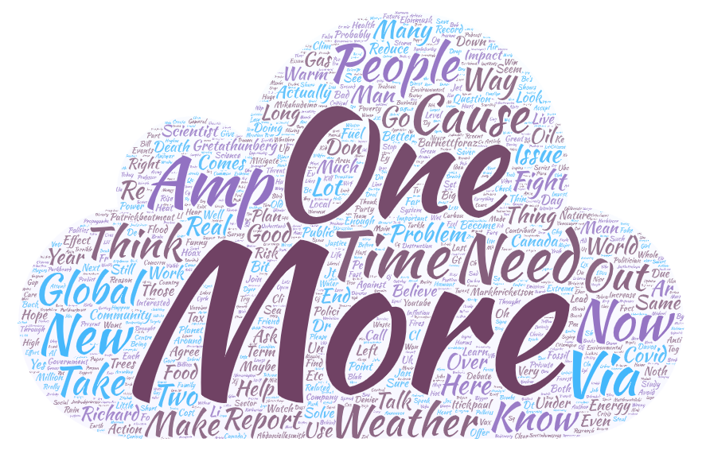

# GEOG458-Lab2

# Summary
## The topic as well as the parameters you have used for search. Why do you want to make this comparison (10 PTS)
The topic I have chosen for this assignment is climate change. I've been interested in the topic for quite some time now, and I feel as though we've been seeing the very effects of climate changes not only in our every lives but from online as well. As the matter of fact, I went through an experience which I believe was only a small part of the upcoming climate change effects - flight. While I was flying out of the states a few weeks ago, I ran into trouble. My flight was meant to fly from Seattle to Vancouver Canada and then to Seoul, South Korea. However, due to weather conditions the plane could not fly, and therefore I had to fly to Denver Colorado - hence the reason why I chose the three cities. I wanted to see the differences among the three cities and if Denver was in a better state in terms of climate changes since flights could fly without much trouble. And whether the conditions were still continuing. That's why I decided to collet tweets from 10 mile radius of the respective cities’ airports. The dates were collected from 01/14/2023 (7 days before) as instructed. 

## Compare the word clouds and discuss the difference or similarity among the word clouds. What might be the possible reasons for the patterns you observed. Anything you find from the map or data that is different from your expectation before the exercise, or anything that stands out to you (15 PTS)
## Seattle Word Cloud

## Denver Word Cloud

## Vancouver Word Cloud

A few things that appear throughout all three word clouds are words CO, People, Climate, and, quite interestingly, More Time. CO and Climate are to be expected as our data are gathered via the keyword ‘climate change’. However, More and Time was unanticipated. Whilst the two words are not necessarily used together, we could think of a few reasons why the two words were mentioned many times across all three cities. One may because of fear. The words More and Time refer to having more space or opportunities to do something in many cases - especially more so in our particular case because climate change has pretty much kindled a ticking bomb. It may also have to do with how climate change is resulting in ‘more-‘ such as more rain, more snow, more traffic, and etc. And therefore the word Time was brought up as the product of ‘more-‘, taking more time to commute, more time for delivery, and etc. Another word that stood out, but only from Denver’s word cloud, was the word Warm. Perhaps the word was being mentioned a lot due to passengers who were going through the same experience that I had. And therefore were tweeting about how warm Denver was compared to other cities. And quite frankly, Denver is significantly warmer than the other two cities and the reports have read that the city of Denver has been getting warmer over time as the result of climate change. Another word that is uniquely being mentioned more in Denver is the word Right. As unexpected it was, I’m not quite sure why the word was being mentioned many times. Perhaps people were discussing about how ‘right’ it is to live in Denver - or how ’right’ the temperature is compared to the eastern and western coastline cities. In Seattle, the word Fight stood out which was not mentioned in other cities. Perhaps it had to do with Seattle’s liberal feature, and that many people were tweeting about joining the ‘Fight’ for climate change. Or perhaps there has been more violence in the city of Seattle as the result of climate change. Nevertheless, there were words I definitely was not expecting to see from the word clouds of climate change.

## how your research could be improved in the future (5 PTS)
I believe my research could be improved in the future if I were to add more cities and collect tweets from a wider date range. Yes, 7 days worth of tweest is still tons of data as people upload posts on Twitter everyday, practically every hour. However, the weather pattern could be not as versatile, and more data tend to result in more accurate and unbiased result. Hence, in the future, I’d improve my research by expanding on the parameters to collect a bigger set of data.

CSV Files URLs:

Seattle: https://drive.google.com/file/d/19QyP1RCNvPV9AOTT26XXEx-7rXCii0Bj/view?usp=sharing 

Vancouver: https://drive.google.com/file/d/1-1Sn4m07QK0x6JzbfqfEdC-w3vXYEFr5/view?usp=sharing

Denver: https://drive.google.com/file/d/1-57cnca_pYfRUYr36aNUECEcg653HSYu/view?usp=share_link
