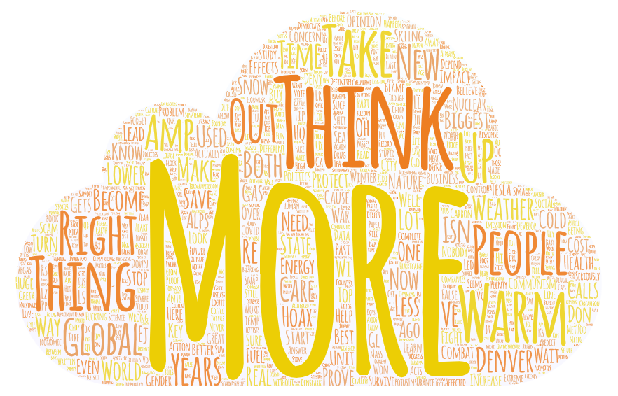

# GEOG458-Lab2

# Summary
## The topic as well as the parameters you have used for search. Why do you want to make this comparison
The topic I have chosen for this assignment is climate change. I've been interested in the topic for quite some time now, and I feel as though we've been seeing the very effects of climate changes not only in our every lives but from online as well. As the matter of fact, I went through an experience which I believe was only a small part of the upcoming climate change effects - flight. While I was flying out of the states a few weeks ago, I ran into trouble. My flight was meant to fly from Seattle to Vancouver Canada and then to Seoul, South Korea. However, due to weather conditions the plane could not fly, and therefore I had to fly to Denver Colorado - hence the reason why I chose the three cities. I wanted to see the differences among the three cities and if Denver was in a better state in terms of climate changes since flights could fly without much trouble. And whether the conditions were still continuing. That's why I decided to collet tweets from 10 mile radius of the respective cities’ airports. The dates were collected from 01/14/2023 (7 days before) as instructed. 

## Compare the word clouds and discuss the difference or similarity among the word clouds. What might be the possible reasons for the patterns you observed. Anything you find from the map or data that is different from your expectation before the exercise, or anything that stands out to you
## Seattle Word Cloud

## Denver Word Cloud

## Vancouver Word Cloud

A word that appeared throughout all three word clouds was 'more'. Perhaps the most obvious reason is because climate change brought about more of many things related to the weather - more rain, snow, and getting hotter. On the same note, that is probably the reason why we see the word 'warm' appear a lot in the city of Denver - because Denver has been getting warmer and warmer every year according to the experts. We also see the word 'amp' appearing frequently in Vancouver's and Seattle's word cloud. According to Urban Dictionary - one of the renowned source for slang words - and Merriam Webster Dictionary the word 'amp' has to do with being louder and being more. And judging from how the word is associated with colder regions perhaps the word 'amp' was mentioned frequently due to frequent rain and snow. In the meantime, we see words that are unique to their respective cities. For instance, the word 'think' and 'thing' are mentioned frequently after the word 'more' in Denver. Perhaps the words were mentioned in tweet posts that were speciualtions, opinions, and/or accusing people to think more of something. In Seattle, the words 'people' and 'world' were mentioned frequently, potentially due to how people were being affected by the climate changes. The world was mentioned perhaps to point out the new changes that are being brought to the world along with climate changes. Lastly, in the city of Vancouver, the words 'one' and 'need' were mentioned frequently. The word 'one' may have been mentioned with 'more', either asking or expressing feelings related to 'one more' of something or someone. 

## how your research could be improved in the future
I believe my research could be improved in the future if I were to add more cities and collect tweets from a wider date range. Yes, 7 days worth of tweest is still tons of data as people upload posts on Twitter everyday, practically every hour. However, the weather pattern could be not as versatile, and more data tend to result in more accurate and unbiased result. Hence, in the future, I’d improve my research by expanding on the parameters to collect a bigger set of data.

CSV Files URLs:

Seattle: https://drive.google.com/file/d/19QyP1RCNvPV9AOTT26XXEx-7rXCii0Bj/view?usp=sharing 

Vancouver: https://drive.google.com/file/d/1-1Sn4m07QK0x6JzbfqfEdC-w3vXYEFr5/view?usp=sharing

Denver: https://drive.google.com/file/d/1-57cnca_pYfRUYr36aNUECEcg653HSYu/view?usp=share_link
